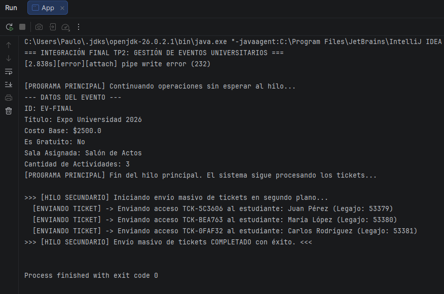

# TP2: Sistema de Gestión de Eventos Universitarios (Avanzado)

**Carrera:** Ingeniería en Sistemas de Información  
**Materia:** Programación Orientada a Objetos / Paradigmas de Programación  
**Institución:** Universidad Tecnológica Nacional - Regional Mendoza

---

## Descripción del Proyecto

Este proyecto es la continuación y evolución del **Trabajo Práctico N°1**, extendiendo el paradigma de Programación Orientada a Objetos en **Java** mediante la aplicación de conceptos avanzados tales como **Excepciones Personalizadas**, **Persistencia de Objetos (Serialización)**, **Interfaces y Polimorfismo**, **Genéricos y Wildcards**, **Clases Anidadas** y **Concurrencia con Hilos (Threads)**.

---

## Tecnologías y Conceptos Aplicados

- **Lenguaje:** Java
- **Excepciones:** Manejo de excepciones verificadas (`CupoExcedidoException`) para control de reglas de negocio.
- **Persistencia (I/O):** Guardado y recuperación de estados de objetos en archivos binares (`.dat`) mediante `Serializable`, `ObjectOutputStream` y `ObjectInputStream`.
- **Interfaces y Polimorfismo:** Implementación de la interfaz `Certificable` para emisión de certificados adaptados según el tipo de actividad (Taller, Curso).
- **Generics & Wildcards:** Uso de parámetros de tipo acotados (`<T extends Actividad>`) y comodines (`? extends Actividad`) para filtrado dinámico y operaciones seguras en colecciones.
- **Clases Anidadas:** Uso de Inner Classes (`TicketDeAcceso` dentro de `Inscripcion`) para encapsular la generación y gestión de credenciales.
- **Multithreading:** Implementación de hilos secundarios (`EnvioTicketsThread` extendiendo `Thread`) para la simulación de procesos asíncronos en segundo plano.

---

## Estructura del Proyecto

El código está organizado modularmente en paquetes según sus responsabilidades:

```text
src/
├── actividades/
│   ├── Actividad.java          (Clase abstracta base)
│   ├── Charla.java             (Subclase)
│   ├── Taller.java             (Subclase - Implementa Certificable)
│   └── Curso.java              (Subclase - Implementa Certificable)
├── certificacion/
│   └── Certificable.java       (Interfaz para emisión de certificados)
├── excepciones/
│   └── CupoExcedidoException.java (Excepción personalizada)
├── hilos/
│   └── EnvioTicketsThread.java (Hilo en segundo plano para envío de tickets)
├── modelo/
│   ├── Estudiante.java         (Clase modelo)
│   ├── Sala.java               (Clase modelo)
│   ├── Inscripcion.java        (Clase modelo + Clase anidada TicketDeAcceso)
│   └── EventoUniversitario.java(Clase principal del modelo, persistencia y genéricos)
├── App.java                    (Clase de prueba e integración del TP2)
└── Main.java                   (Clase de ejecución del TP1 adaptada)

## Evidencia de Ejecución


